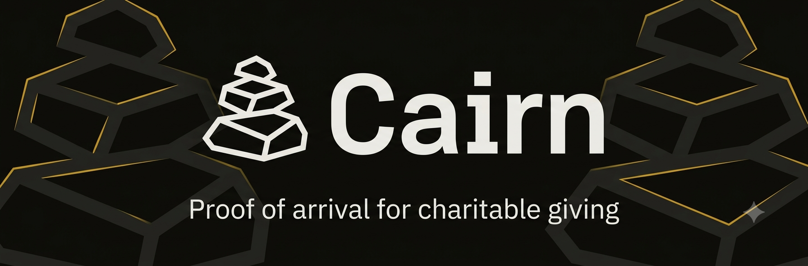
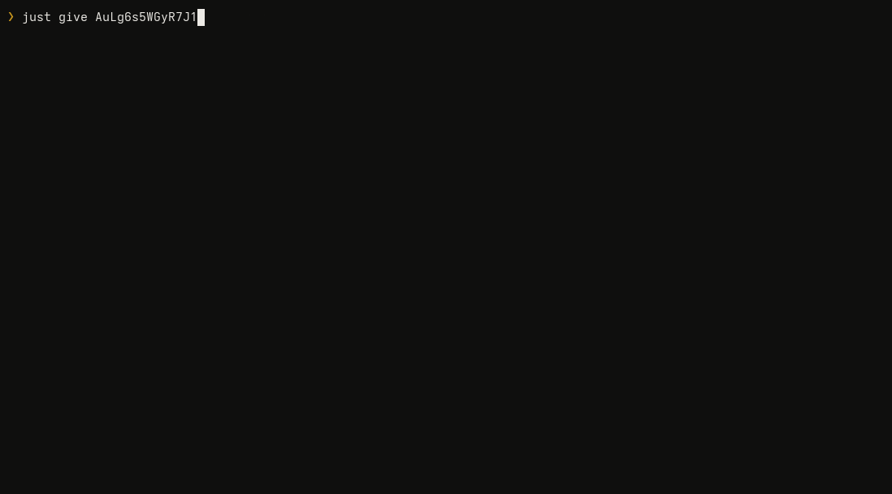
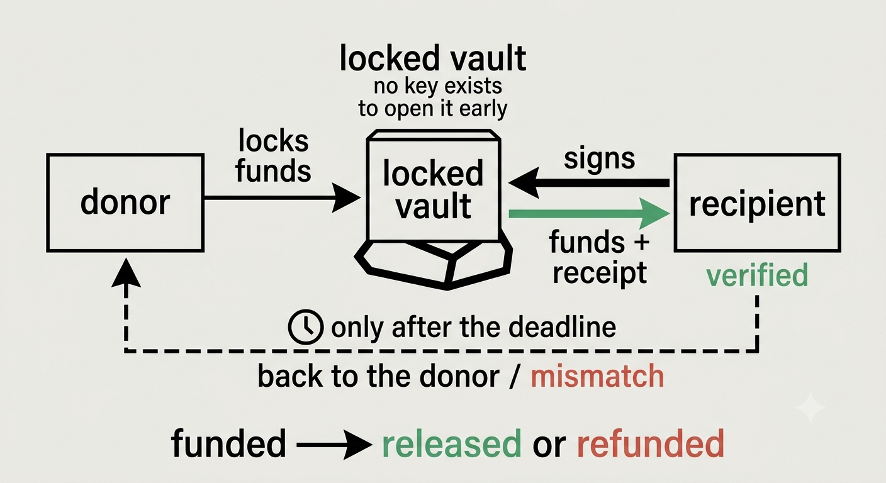

<div align="center">
  
</div>

<br>

A weekend build. Lock some SOL for someone; they only get it by signing a
transaction that carries the hash of a voice recording saying what they
received.


```sh
cairn give     --to <them> --amount 0.05 --for "one term of school fees"
cairn receive  --escrow <pubkey> --audio receipt.wav     # they run this
cairn verify   <signature>                               # anyone runs this
```

<div align="center">
  
</div>

A real session against a local validator — the escrow is created on chain, the
receipt is signed by the recipient's key, and the failure at the end is a
genuine hash mismatch after the stored recording is altered. Also available as
[mp4](assets/demo.mp4), or replay it yourself with
`asciinema play assets/demo.cast`.

---

## The itch

Donation platforms verify that money left you. They don't verify it reached a
person. The receipt you get is issued by the intermediary holding the funds —
so the thing you're trusting and the thing producing the evidence are the same
thing.

Cairn turns that around. Funds sit in a Solana escrow no intermediary can
touch. Release needs a signature from the recipient's own wallet, and that
transaction carries a hash of a recording where they say, in their own words,
what they got. The receipt comes from the person at the end of the chain, and
the chain binds it to the transfer.


## The name

A cairn is a stack of stones raised by travellers along a route. Each
passer-by adds one. It proves someone came through, and it guides whoever
comes next. Nobody owns it, nobody supervises it, and anyone who walks up can
read it.

Every clause of that maps onto something the software does. Each passer-by
adds one — every release appends a receipt nobody can remove. Nobody owns it —
there is no operator key and no admin override. Anyone can read it —
verification runs offline, on a stranger's laptop, against artifacts they
fetched themselves.

<br clear="right">

## The part that isn't obvious

Two things look similar here and are not.

**Authorization** is an ed25519 signature from the recipient key the donor
named at creation. Enforced on chain. Can't be forged. No server, operator, or
platform key substitutes for it.

**Testimony** is the recording. Human evidence, hashed and committed on chain
so it's tamper-evident and welded to one transaction signature.

Voice authorizes nothing. Treat a recording as an authentication factor and
you've built something that replay or a decent TTS model walks straight
through. Here it's attached evidence with guaranteed integrity — not proof of
identity. That distinction is the whole design; everything else falls out of
it.

## What it doesn't solve

Worth saying out loud, because a project like this attracts the assumption
that it solves more than it does:

- **Coercion.** Someone forced to sign produces a receipt indistinguishable
  from a real one.
- **Key loss.** No recovery. The funds go back to the donor at the deadline
  and that's the only remedy there is.
- **Fake needs.** Anyone can open an escrow to any address with any
  description. Cairn proves money arrived at a key. It proves nothing about
  who holds that key.
- **Identity.** No KYC, no reputation, no attestation that a recipient is who
  they say they are.
- **Transcription accuracy.** A wrong transcript gets faithfully hashed and
  faithfully committed.

---

## How it goes

<div align="center">
  
</div>

Note the asymmetry: the recipient's way out is a signature, the donor's way
back is a deadline. There is no third arrow, and nobody in the middle.

The hash covers a canonical structure:

```
receipt_hash = sha256(
    b"cairn:receipt:v1" ‖ escrow(32) ‖ audio_sha256(32) ‖ transcript ‖ locale(8) ‖ recorded_at(8)
)
```

Every field except the transcript is fixed width, so for a preimage of length
`L` the transcript is always exactly `L - 96` bytes. That makes the encoding
injective with no length prefixes — there's no pair of distinct receipts that
concatenate to the same bytes. Add a second variable-length field and that
stops being true, which is why there's a test called
`transcript_and_locale_do_not_smear`.

Transcripts are NFC-normalised, trimmed, and have whitespace runs collapsed
before hashing. Skip that and the same recording hashes differently depending
on whose machine composed the receipt.

### One hash, two targets

`cairn-core` compiles to both `sbf-solana-solana` and the host. The program,
the CLI and the server all call the same `receipt_hash()`. Not "kept in sync"
— the same function. Same story for the `Escrow` account layout: it's defined
once in `cairn-core`, and the on-chain program wraps it in a newtype that
Anchor's traits hang off, so the bytes the program writes are the bytes the
indexer reads. A test asserts Anchor's generated discriminator equals the
constant the decoder uses.

This got easier when the frontend went away. A browser client meant a
hand-written TypeScript reimplementation of the hash, and it carried a comment
admitting the two couldn't fully agree — JavaScript's `\s` and Rust's
`char::is_whitespace` disagree about U+FEFF. Deleting the UI deleted the only
duplicate.

---

## Verifying without trusting us

The interesting command:

```sh
cairn verify 4mZ8...9xKp
```

It fetches the transaction from an RPC node, pulls the committed hash out of
the `submit_receipt` instruction, downloads the audio, **re-hashes the bytes
it actually got back**, rebuilds the canonical receipt, and compares.

```
  PASS  verified
        the recording was re-downloaded, re-hashed, and reproduces
        the hash committed on chain by the recipient

  committed on chain   664ad19e69bd18ea8acdc4a6861d404…
  recomputed here      664ad19e69bd18ea8acdc4a6861d404…
  audio re-hashed      yes
```

`match: false` and `audio_available: false` are different answers and it says
so. A missing recording is a gap in our records, not evidence against the
receipt. Collapsing those two into one verdict would be the most misleading
thing this thing could do.

And if you don't want to ask our server anything:

```sh
cairn hash receipt \
  --escrow <ESCROW_PUBKEY> \
  --audio ./receipt.wav \
  --transcript "what they said" \
  --locale en \
  --recorded-at 1757000000
```

No server, no key, no network. Compare with what the explorer shows in the
release transaction.

The recipient gets this too: `cairn receive` recomputes the hash locally from
the file on their disk before it will sign anything, and refuses if the server
came back with something that doesn't cover it.

---

## Layout

```
cairn/
├── programs/cairn/      Anchor program — custody, authorization, state machine
├── crates/
│   ├── cairn-core/      Canonical receipt, hashing, seeds, account layout. SBF + host.
│   ├── cairn-api/       Blob store, index, verifier. Holds no keys.
│   └── cairn-cli/       The client. All of it.
├── assets/
└── docs/
```

The server is deliberately boring and deliberately powerless. It stores audio,
polls the chain into SQLite, and recomputes hashes on request. It has no
keypair, no signing path, and no instruction it could call to move a lamport.
Compromise it completely and the worst you get is wrong transcripts and
deleted blobs — both detectable, because the hash that matters is on chain.

---

## Running it

Needs Rust 1.89+, the Agave CLI, and [`just`](https://github.com/casey/just).
Anchor CLI is *not* required — Cairn doesn't use an IDL, so `cargo build-sbf`
and `solana program deploy` are the whole toolchain.

```sh
cargo install just
just install-toolchain          # Agave
just keys && just sync-id       # self-contained keypairs in .demo/

just validator                  # terminal 1
just fund && just deploy
just api                        # terminal 2
```

Then, in a third:

```sh
just give <their-pubkey> 0.05 "one term of school fees"
just sample-audio receipt.wav   # or: arecord -f cd -d 10 receipt.wav
just receive <escrow> receipt.wav
just verify <signature>
```

`just` on its own lists every recipe. **[docs/COMMANDS.md](docs/COMMANDS.md)
walks the whole loop with real terminal output at each step**, including what
a failed verification looks like.

It runs with no ElevenLabs key and no bucket — transcripts come back empty
(still a valid receipt) and audio lands in `./blobs`. For R2, set the `R2_*`
vars and build with `--features s3`.

---

## Corners cut, on purpose

Each of these is a real trade. Listed here rather than buried, with what would
make it worth revisiting.

- **The indexer polls every 3s instead of using `programSubscribe`.** One code
  path instead of four, and three of the four only run when something has
  already gone wrong — which makes them the three least likely to have been
  tested. Revisit past a few thousand escrows.
- **Expiry is a read-time predicate, not a background worker.** Simpler, and
  never up to 60 seconds stale.
- **Audio duration comes from a WAV header parse where possible, a byte floor
  otherwise.** Getting it right for every container means demuxing webm/opus
  server-side, for a three-second minimum that exists to stop empty uploads.
- **The challenge nonce store is in-process.** A nonce lives 120 seconds;
  losing them all on deploy costs someone one retry. Needs Redis only if the
  API ever runs as more than one replica.
- **The CLI hand-encodes nothing.** It imports the program's own generated
  instruction types and the API's own response types, so drift is a compile
  error rather than a bad transaction.

## Things that bit, in case they bite you

- `anchor-lang 1.2` and `solana-sdk 3.x` are from different generations of the
  Solana crate split. `Pubkey`, `Account` and `Transaction` resolve to
  different types with identical names and nothing lines up. Use `solana-sdk 4`.
- `litesvm` is on 0.16. Older versions pin the 3.x generation and produce the
  same mess.
- `CpiContext::new` takes a `Pubkey` now, not an `AccountInfo`.
- Splitting instructions into modules means `pub use module::*` — glob, not
  named. `#[derive(Accounts)]` also emits `__client_accounts_*` modules that
  `#[program]` resolves at the crate root, and naming only the structs leaves
  the macro with an unresolved `crate::` import that reads like an Anchor bug.
  Handlers then need a prefix, because `#[program]` exports functions under
  the bare instruction names itself.
- borsh 1.x won't guess for enums with explicit discriminants; you need
  `#[borsh(use_discriminant = true)]`.
- `cargo-build-sbf` still defaults to `--arch v0`, and SIMD-0500 disabled
  deployment of v0, v1 and v2. The default build produces a `.so` no current
  cluster will accept, and only tells you at deploy time.
- LiteSVM reuses its blockhash, so sending the same instruction twice makes a
  byte-identical transaction that the runtime rejects as a duplicate *before
  the program runs* — a test asserting a terminal state refuses a second
  attempt will fail for entirely the wrong reason. `expire_blockhash()`
  between sends.

---

## Credits

[Anchor](https://www.anchor-lang.com/), [Agave](https://github.com/anza-xyz/agave),
[LiteSVM](https://github.com/LiteSVM/litesvm), [Axum](https://github.com/tokio-rs/axum),
and [ElevenLabs Scribe](https://elevenlabs.io/) for speech-to-text.

MIT. See [LICENSE](./LICENSE).
