# Commands

Everything Cairn does, in the order you'd actually do it.

Every screenshot on this page is real captured output from the run that
produced this document — a local validator, the program deployed to it, the
API indexing it, and the CLI driving the whole loop. Nothing is retyped or
mocked up.

Two things about that run, stated up front so nothing below misleads:

- **Transcripts are empty.** No `ELEVENLABS_API_KEY` was set. That is a
  designed path, not a broken one: transcription is best-effort, and a receipt
  with an empty transcript is still a valid receipt because the hash covers
  the audio either way. With a key set, the transcript appears in the same
  place.
- **The recording is a generated tone**, not speech — there's no microphone on
  the machine that produced these. The pipeline is content-agnostic; it hashes
  bytes.

---

## Contents

- [Prerequisites](#prerequisites)
- [One-time setup](#one-time-setup)
- [Bringing up a chain](#bringing-up-a-chain)
- [The loop](#the-loop)
- [Verifying without trusting the server](#verifying-without-trusting-the-server)
- [When the program says no](#when-the-program-says-no)
- [Tests](#tests)
- [Every recipe](#every-recipe)
- [Devnet instead of local](#devnet-instead-of-local)
- [Troubleshooting](#troubleshooting)

---

## Prerequisites

| Tool | Why | Install |
|---|---|---|
| Rust 1.89+ | everything | [rustup.rs](https://rustup.rs) |
| Agave CLI 4.x | builds the program, runs the validator, deploys | `just install-toolchain` |
| `just` | the task runner below | `cargo install just` |
| `ffmpeg` | generates placeholder audio; optional if you have a mic | your package manager |

**Anchor CLI is not required.** `anchor build` exists to compile the program
*and* emit an IDL, and Cairn deliberately doesn't use an IDL — the client
decodes accounts through `cairn-core` and imports the program's instruction
types directly. So `cargo build-sbf` and `solana program deploy` are the whole
toolchain, which skips a long `anchor-cli` compile.

---

## One-time setup

```sh
just install-toolchain     # Agave, if you don't have it
cargo install just         # if you're reading this, probably already done
just keys                  # program, donor and recipient keypairs into .demo/
just sync-id               # writes the program pubkey into lib.rs + Anchor.toml
```

`just keys` never touches `~/.config/solana/id.json`. Everything lands in
`.demo/`, which is gitignored — the demo is self-contained and cannot clobber
a wallet you care about.

`just sync-id` is `anchor keys sync` done by hand: it rewrites `declare_id!()`
and `Anchor.toml` so the deployed address matches what the program claims to
be. Skip it and every instruction fails with a program-id mismatch.

---

## The task surface

`just` with no arguments lists everything:

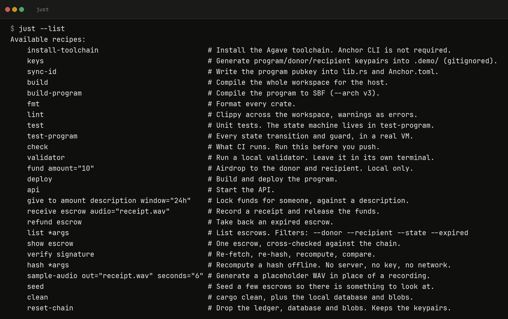

---

## Bringing up a chain

Three terminals, or three backgrounded commands.

```sh
just validator     # terminal 1 — leave it running
just fund          # 10 SOL each to donor and recipient
just deploy        # builds for SBF, then deploys
just api           # terminal 2 — leave it running
```

`just fund` airdrops on a **local validator only**. Cairn itself never
airdrops: devnet throttles them, and a failed airdrop mid-demo is
indistinguishable from a broken program. On devnet you fund the donor
yourself.

`just deploy` builds with `--arch v3`. That is not a preference — see
[Troubleshooting](#troubleshooting).

The API needs no key and cannot sign anything. It indexes the chain into
SQLite, stores audio, and recomputes hashes on request.

---

## The loop

### `just give` — lock funds against a description

```sh
just give <recipient-pubkey> 0.05 "Covers one term of school fees and a set of textbooks."
```

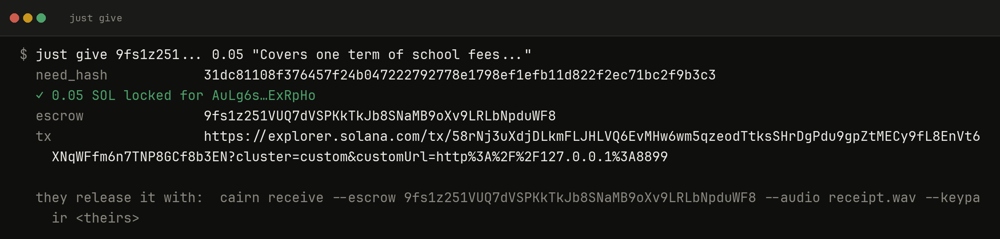

The `need_hash` is printed before the transaction is sent, because it is what
gets committed. The description text itself lives off-chain; only its hash is
on the chain, and everything downstream re-derives it.

Note the explorer link carries `cluster=custom&customUrl=…` — the CLI reads
the cluster off the RPC endpoint rather than assuming devnet.

### `just list` — what's out there

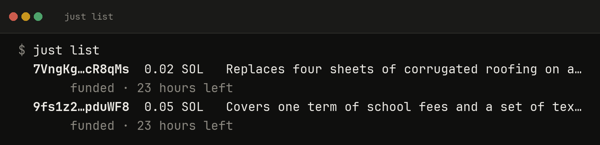

Served from the local read model, not from RPC. The indexer polls every three
seconds.

### `just show` — one escrow, cross-checked

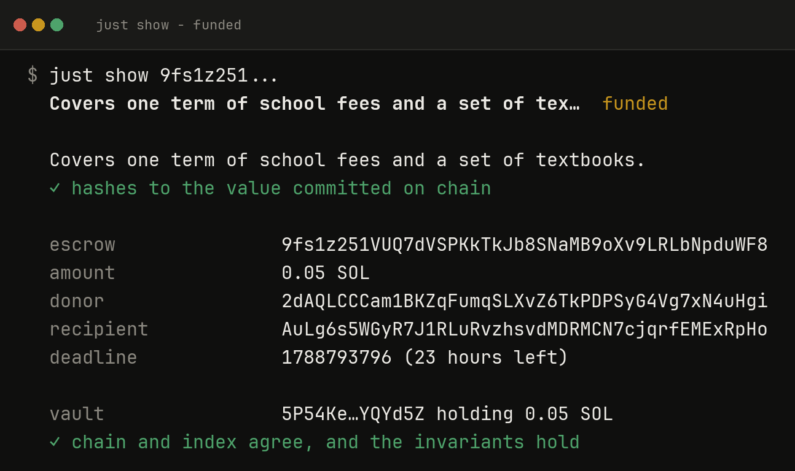

Two independent checks run here, and both are the point of the command:

1. **`✓ hashes to the value committed on chain`** — the description was
   re-hashed in the client and compared with the on-chain `need_hash`. The API
   could serve any text it liked for this escrow; this is what makes that not
   matter. A mismatch prints `✗ TAMPERED` and both hashes.
2. **`✓ chain and index agree, and the invariants hold`** — the account was
   read straight from RPC, decoded with `cairn-core`, and checked against the
   read model. An indexer that has quietly drifted can't hide behind a
   confident-looking record.

### `just receive` — record, then release

```sh
just sample-audio receipt.wav 6      # or: arecord -f cd -d 10 receipt.wav
just receive <escrow> receipt.wav
```

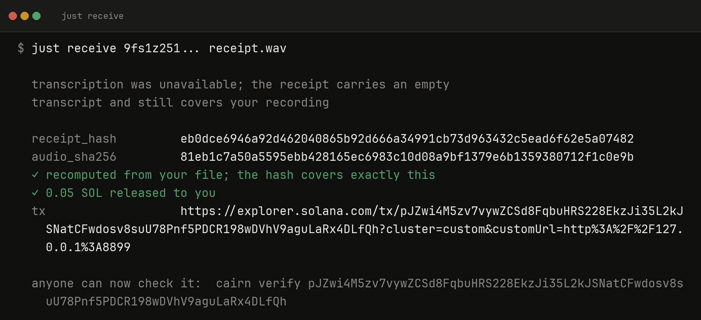

The line that matters is **`✓ recomputed from your file`**. Before signing,
the CLI rebuilds the canonical receipt from the audio on your own disk and
checks it reproduces the hash the server returned. If it doesn't, it refuses
to sign — a recipient should never have to take the server's word for what
they're putting their signature on.

The funds and the receipt hash move in the same instruction. There is no
window in which one exists without the other.

### After release

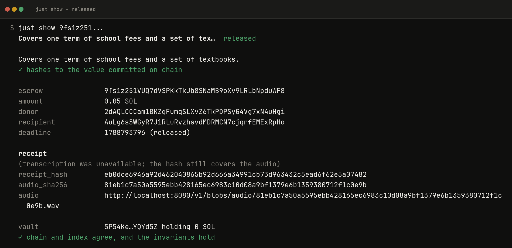

The vault holds `0 SOL`, the receipt hash is on the account, and the
invariants still hold — `receipt_hash` non-zero if and only if `Released`, and
an empty vault if and only if not `Funded`.

---

## Verifying without trusting the server

### `just verify` — the whole claim

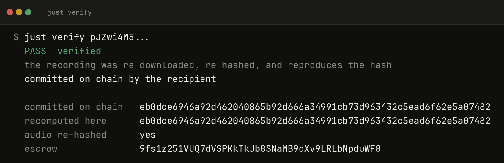

This re-fetches the transaction from RPC, pulls the committed hash out of the
`submit_receipt` instruction, re-downloads the audio, **re-hashes the bytes it
actually got back**, rebuilds the receipt and compares. The two hashes on
screen were computed by different means, minutes apart.

### The same command when something is wrong

Here the stored recording was altered by 45 bytes after the fact:

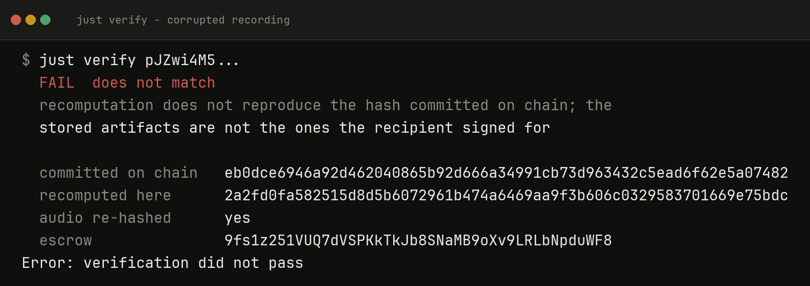

`FAIL`, two visibly different hashes, and a non-zero exit code so it can gate
a script. This is distinct from `recording unavailable`, which is what a
*missing* blob gives you — a gap in our records is not evidence against a
receipt, and collapsing those two answers into one would be the most
misleading thing this tool could do.

### Or don't use our server at all

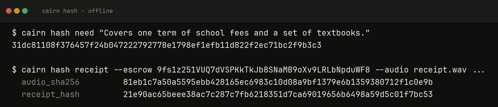

`cairn hash` touches no network, needs no key, and reads no database. Compare
its output with what a block explorer shows in the release transaction.

The `need` hash above is `31dc8110…` — byte-identical to the `need_hash` that
`just give` committed on chain in the screenshot further up. That's the whole
argument in one line: an independent recomputation reproducing the
commitment.

### Aggregates

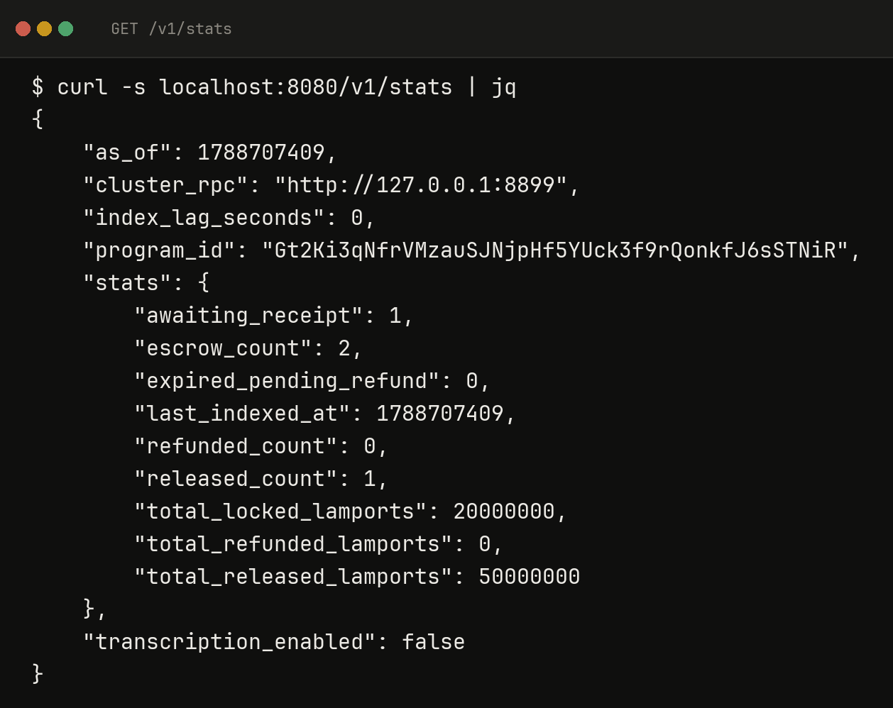

`index_lag_seconds` is surfaced so a caller can say "the index is N seconds
behind" rather than silently showing stale numbers.

---

## When the program says no

Refunding before the deadline:

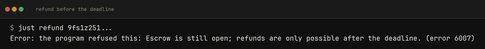

The sentence comes from the program itself — Anchor writes the `#[msg(...)]`
text into the transaction logs, and the client surfaces that instead of the
several-kilobyte simulation dump the RPC actually returns. There's no error
table in the client to drift out of step.

Every guard has its own code. The full list is in
[ARCHITECTURE.md](./ARCHITECTURE.md#guards-and-their-error-codes).

---

## Tests

```sh
just test           # unit tests: hashing, normalisation, decoding, auth, parsers
just test-program   # the state machine, in a real VM
just check          # fmt + clippy + both suites — what CI runs
```

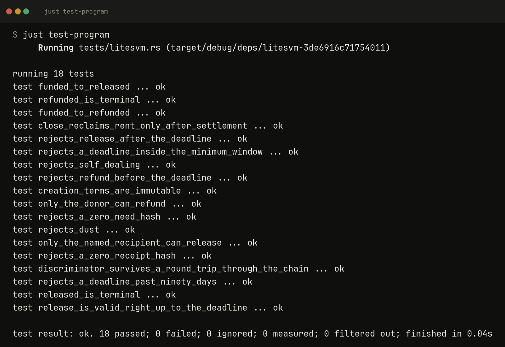

Every state transition has a happy-path test, every guard has a negative test
asserting its *specific* error code, and the invariants are re-checked after
each transition rather than only at the end.
`only_the_named_recipient_can_release` is the one that matters most: if it
ever passes for an impostor, Cairn has no trust model.

---

## Every recipe

| Recipe | What it does |
|---|---|
| `just` | list all recipes |
| `just install-toolchain` | install Agave |
| `just keys` | generate program/donor/recipient keypairs into `.demo/` |
| `just sync-id` | write the program pubkey into `lib.rs` and `Anchor.toml` |
| `just build` | `cargo build --workspace` |
| `just build-program` | compile the program to SBF (`--arch v3`) |
| `just fmt` | `cargo fmt --all` |
| `just lint` | clippy with `-D warnings` |
| `just test` | unit tests |
| `just test-program` | LiteSVM state-machine suite |
| `just check` | fmt + lint + both suites |
| `just validator` | run a local test validator |
| `just fund [amount]` | airdrop to donor and recipient (local only) |
| `just deploy` | build and deploy |
| `just api` | run the API server |
| `just give <to> <amount> <text> [window]` | lock funds |
| `just receive <escrow> [audio]` | record a receipt and release |
| `just refund <escrow>` | recover an expired escrow |
| `just list [args]` | list escrows |
| `just show <escrow>` | one escrow, cross-checked against the chain |
| `just verify <signature>` | re-fetch, re-hash, recompute, compare |
| `just hash need <text>` / `just hash receipt …` | offline recomputation |
| `just sample-audio [out] [seconds]` | generate a placeholder WAV |
| `just seed` | create several escrows via `demo.sh` |
| `just clean` | `cargo clean` plus the local DB and blobs |
| `just reset-chain` | drop the ledger, DB and blobs; keep the keypairs |

The CLI underneath takes `--rpc`, `--program-id` and `--api`, or the matching
`SOLANA_RPC_URL`, `CAIRN_PROGRAM_ID` and `CAIRN_API_URL` environment
variables. `just` fills them in from `.demo/`.

Colour follows [no-color.org](https://no-color.org): set `NO_COLOR` to
disable, `CLICOLOR_FORCE` to keep it through a pipe.

---

## Devnet instead of local

Every recipe takes a `CLUSTER` variable:

```sh
export CLUSTER=devnet
solana airdrop 2 "$(solana address -k .demo/donor.json)" --url devnet
just deploy
just api
```

Local is the default because devnet airdrops are rate-limited and frequently
fail outright, which makes a walkthrough unreproducible. Everything else is
identical — the program, the API and the CLI don't know or care which cluster
they're pointed at.

---

## Troubleshooting

**`Detected sbpf_version required by the executable which are not enabled`
when deploying.** `cargo-build-sbf` still defaults to `--arch v0`, and
SIMD-0500 disabled deployment of v0, v1 *and* v2 on current clusters. The
default build produces a `.so` that nothing will accept, and only says so at
deploy time. Build with `--arch v3`; `just build-program` already does.

**`expected solana_pubkey::Pubkey, found Address`.** Two generations of the
Solana crate split resolved into one tree. `anchor-lang 1.2` needs
`solana-sdk 4.x` and `litesvm 0.16`; the 3.x line belongs to `anchor 1.0`.
The version table is in
[ARCHITECTURE.md](./ARCHITECTURE.md#versions-and-why-they-are-pinned-where-they-are).

**LiteSVM tests fail with `AlreadyProcessed`.** Two identical instructions
from the same signer on the same blockhash produce a byte-identical
transaction, and the runtime rejects the second as a duplicate signature
before the program runs. Call `expire_blockhash()` between sends, the way a
real client fetches a fresh one per call.

**`that escrow is not indexed yet`.** Fixed — `POST /v1/needs` now falls back
to reading the account straight from the chain when the read model hasn't
caught up. If you see it again, the escrow genuinely doesn't exist.

**Transcripts are always empty.** `ELEVENLABS_API_KEY` is unset. This is a
supported path, not a fault; the API logs a warning at boot.

**`just hash need` complains about an unexpected argument.** You're on an old
checkout — the recipe used to word-split its arguments.
